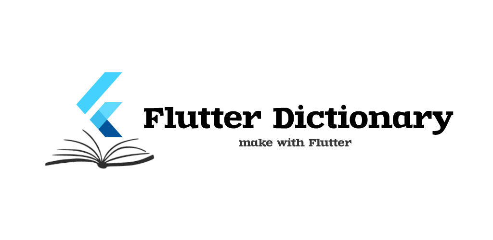
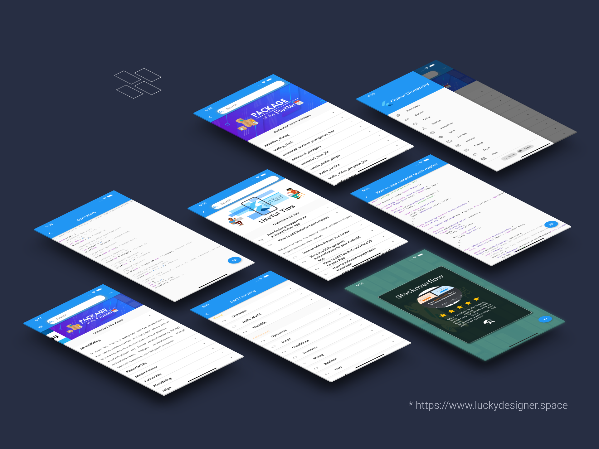

# Flutter-Dictionary
       
A simple dictionary about Flutter

# Screenshot

# Version   
2021.8.20
  - **Flutter Collected Items**: 154
  - **Packages Collected Items**: 204
  - **Tips Collected Items**: 57
  - **Dart Tutorial Items**: 26
  - **Develop tools Collected Items**: 6

# Features
  - Search and learn Flutter widget and more
  - Show a list of Flutter packages, you can learn the details
  - You can learn Dart programming language basic, advanced and more
  - Collect some random sources to learn Flutter and Dart
  - Show a list of Flutter questions and preview the code
  - more...

# License 

This program is free software: you can redistribute it and/or modify it under the terms of the GNU General Public License as published by the Free Software Foundation, either version 3 of the License, or any later version.

This program is distributed in the hope that it will be useful, but WITHOUT ANY WARRANTY; without even the implied warranty of MERCHANTABILITY or FITNESS FOR A PARTICULAR PURPOSE. See the GNU General Public License for more details.